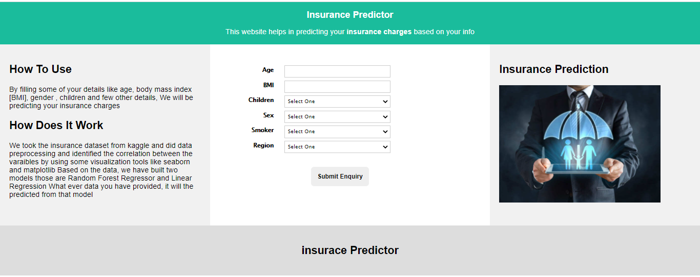
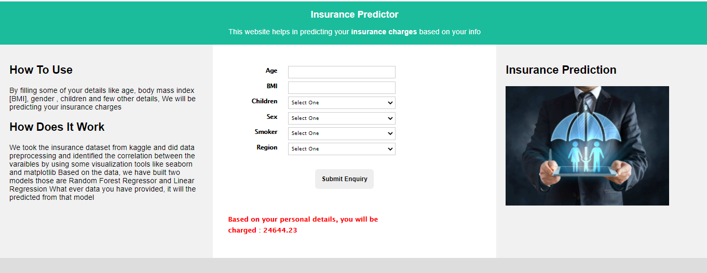

# Insurance Prediction - Deployment
  

• This repository consists of files required to deploy a ___Machine Learning Web App___ created with ___Flask___ on ___Heroku___ platform.

• If you want to view the deployed model, click on the following link:<br />
Deployed at: _https://google.com_


• Please do ⭐ the repository, if it helped you in anyway.

• A glimpse of the web app:

 
 

 

## Development

Want to run the application in your local system? Great

Download the repository

Open your favorite Terminal and run these commands.

First Tab:

```sh
pip install requirements.txt
```

```sh
python app.py
```